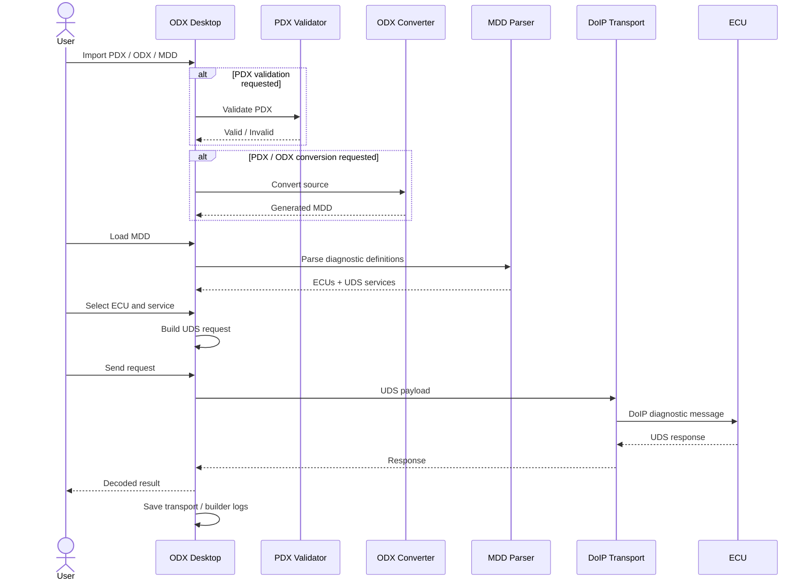

# ODX Desktop

ODX Desktop is a cross-platform diagnostic engineering application for working with **ODX/PDX**, **MDD**, and **UDS over DoIP**.

It provides one interface to:

- import and manage PDX / ODX / MDD files;
- validate PDX files;
- convert PDX / ODX data to MDD;
- inspect MDD diagnostic definitions;
- select an ECU and browse its supported UDS services;
- build UDS requests;
- validate raw UDS frames;
- decode UDS responses;
- build and execute diagnostic sequences;
- communicate with an ECU over DoIP;
- save diagnostic logs in the selected project output folder.

---

## 1. Main Workflow

```text
PDX / ODX
    |
    v
Validator & Converter
    |
    v
MDD
    |
    v
Diagnostics
    |
    +--> ECU selection
    |
    +--> UDS Request Builder
    |
    +--> Frame Validator
    |
    +--> Response Decoder
    |
    +--> Sequencer
    |
    v
DoIP transport
    |
    v
ECU
```

Generated logs are saved in the selected project output folder:

```text
uds_transport.log
uds_builder.log
```

---

## 2. Sequence Diagram



---

## 3. Main Components

### Workspace

The Workspace keeps the diagnostic sources used by the project.

Supported source types include:

- `.pdx`
- ODX source files supported by the converter
- `.mdd`

The user can select source files and open them in **Validator & Converter**.

### Validator & Converter

Used to:

- validate a PDX file;
- convert PDX / ODX data to MDD;
- select the output folder for generated MDD files.

### Diagnostics

Loads an MDD file and extracts:

- ECU / variant information;
- diagnostic services;
- request definitions;
- parameters;
- responses and related metadata.

### UDS Request Builder

Builds a UDS request from the selected MDD service.

Fixed data can be filled automatically from the MDD, while runtime values can be entered by the user.

### Frame Validator

Checks whether a raw UDS request matches a known diagnostic definition from the loaded MDD.

### Response Decoder

Decodes positive and negative UDS responses using information from the loaded MDD.

### Sequencer

Allows multiple UDS requests to be organized and executed in sequence.

A sequence can include settings such as:

- timeout;
- delay;
- expected positive SID;
- stop / continue behavior;
- response-based conditions.

### DoIP Transport

Sends UDS diagnostic requests to an ECU using DoIP and receives the ECU responses.

---

## 4. Important Dependencies

The exact Rust package versions are defined by:

```text
src-tauri/Cargo.toml
src-tauri/Cargo.lock
src-tauri/vendor/odx-converter-rs/Cargo.toml
```

Main dependency groups include:

### Desktop application

- **Rust**
- **Tauri 2**
- WebView2 on Windows
- WebKitGTK on Linux

### ODX / PDX converter

The converter uses Rust libraries for:

- XML parsing;
- ZIP / PDX reading;
- FlatBuffers;
- Protocol Buffers;
- LZMA / XZ compression;
- Zstandard compression;
- LZ4 compression;
- hashing;
- logging;
- parallel processing.

Important converter crates currently include:

```text
roxmltree
zip
flatbuffers
prost
xz2
lzma-rs
zstd
lz4_flex
rayon
serde
serde_json
regex
sha2
chrono
```

### Manual MDD decoding

The manual parsing workflow additionally uses:

```text
Python 3
blackboxprotobuf
flatc
diagnostic_description.fbs
```

Flow:

```text
MDD
 |
 v
flb.py
 |
 v
FlatBuffer .bin
 |
 v
flatc + diagnostic_description.fbs
 |
 v
JSON
```

---

## 5. Windows Build Dependencies

Recommended:

```text
Windows 10 / 11 64-bit
```

Install:

- Visual Studio 2022 Build Tools
  - Desktop development with C++
  - Windows SDK
- Rust / Cargo
- Tauri CLI 2
- Microsoft Edge WebView2 Runtime

For manual MDD decoding only:

- Python 3
- `blackboxprotobuf`
- `flatc.exe`

Build:

```powershell
cargo tauri build
```

Windows output:

```text
src-tauri\target\release\odx-desktop.exe
src-tauri\target\release\bundle\nsis\
```

---

## 6. Linux Build Dependencies

Recommended:

```text
Ubuntu / Debian 64-bit
```

Install:

```bash
sudo apt update

sudo apt install -y \
  build-essential \
  curl \
  git \
  pkg-config \
  libssl-dev \
  libglib2.0-dev \
  libdbus-1-dev \
  libgtk-3-dev \
  libwebkit2gtk-4.1-dev \
  libayatana-appindicator3-dev \
  librsvg2-dev \
  patchelf
```

Purpose of the main native packages:

- `build-essential` — compiler, linker and native build tools;
- `pkg-config` — locates installed native libraries;
- `libssl-dev` — OpenSSL development files;
- `libglib2.0-dev` — GLib development files;
- `libdbus-1-dev` — D-Bus integration;
- `libgtk-3-dev` — GTK development files;
- `libwebkit2gtk-4.1-dev` — Tauri webview backend on Linux;
- `libayatana-appindicator3-dev` — desktop indicator/tray integration;
- `librsvg2-dev` — SVG rendering;
- `patchelf` — Linux packaging support.

Build:

```bash
cargo tauri build
```

Linux output:

```text
src-tauri/target/release/odx-desktop
src-tauri/target/release/bundle/deb/
src-tauri/target/release/bundle/appimage/
```

---

## 7. Standalone Converter

The PDX / ODX converter can be built and used without the desktop application.

```bash
cd src-tauri/vendor/odx-converter-rs
cargo build --release
```

Linux:

```bash
./target/release/odx-converter "/path/to/vehicle.pdx"
```

Windows:

```powershell
.\target\release\odx-converter.exe "C:\Diagnostic\vehicle.pdx"
```

An existing MDD can also be decoded directly:

```bash
./target/release/odx-converter --decode "/path/to/vehicle.mdd"
```

---

## 8. Current Limitations

### PDX validator is platform-specific

The Windows build currently uses:

```text
pdx_validator.exe
```

A Windows executable cannot run natively on Linux.

Linux PDX validation therefore requires a native Linux validator:

```text
src-tauri/pdx_validator
```

PDX / ODX conversion itself is independent from this validator.

### Large diagnostic databases

Large PDX and MDD files can require significant:

- RAM;
- CPU time;
- disk space;
- parsing time.

### ECU communication

Successful live diagnostics depend on:

- reachable ECU IP address;
- correct DoIP logical address;
- network configuration;
- ECU session / security state;
- ECU support for the requested service.

### Platform builds

Windows and Linux release binaries should normally be built and tested on their corresponding platforms.


---

## 9. Copyright, Licenses and Commercial Distribution
### LZMA / compression libraries

The application uses compression libraries such as:

```text
lzma-rs
xz2 / liblzma
zstd
lz4_flex
```

These are open-source components and the versions currently used are intended for use under permissive open-source terms.

### Tauri, FlatBuffers and other open-source libraries

Tauri, FlatBuffers and many Rust dependencies use permissive licenses such as:

```text
MIT
Apache-2.0
BSD-family licenses
```
### `diagnostic_description.fbs`

The FlatBuffers diagnostic schema used by the converter originates from / is related to the Eclipse OpenSOVD ecosystem.

Its existing copyright and Apache-2.0 attribution must be preserved.


### ASAM ODX XSD files

Files such as:

```text
odx_2_2_0.xsd
odx-xhtml.xsd
```

---
